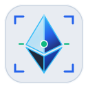
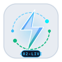

# Agent SafePay — Brand Logos & Vector Assets Registry

This document catalogues the complete brand identity and vector iconography system for **Agent SafePay (W3A-1)**. 

To eliminate repetitive visual identity, the system features **6 distinct architectural insignia**, each engineered as a zero-dependency **Scalable Vector Graphic (SVG)** alongside high-resolution PNG assets.

---

## 1. Multi-Variant Logo Showcase

Every logo variant represents a specific security or protocol pillar in the Agent SafePay stack. Both native **SVG** and **PNG** assets are provided:

| Identity Pillar | Variant Key | Vector File (SVG) | High-Res Raster (PNG) | Preview (Vector SVG) | Exact Alt Text | Purpose & Architecture |
| :--- | :--- | :--- | :--- | :---: | :--- | :--- |
| **Vault Shield** | `shield` | [`/logo/agent-safepay-shield.svg`](./frontend/public/logo/agent-safepay-shield.svg) | [`/logo/agent-safepay-shield.png`](./frontend/public/logo/agent-safepay-shield.png) |  | `Agent SafePay Vault Logo` | **Primary Brand Identity**: Tactile vault contour, cyan keyhole core, and emerald invariant confirmation arc. |
| **AI Agent Key** | `agent-key` | [`/logo/ai-agent-key.svg`](./frontend/public/logo/ai-agent-key.svg) | [`/logo/ai-agent-key.png`](./frontend/public/logo/ai-agent-key.png) |  | `Agent SafePay Vault Logo` | **Autonomous Agent Signer**: Restricted AI keyhead with neural lattice, dual-signer amber brackets, and cryptographic teeth. |
| **EVM Contract Guard** | `evm-guard` | [`/logo/evm-contract-guard.svg`](./frontend/public/logo/evm-contract-guard.svg) | [`/logo/evm-contract-guard.png`](./frontend/public/logo/evm-contract-guard.png) |  | `Agent SafePay Vault Logo` | **Smart Contract Bytecode**: Faceted Ethereum diamond geometry encased in four invariant steel vault brackets. |
| **HTTP-402 Stream** | `http402` | [`/logo/http402-payment-stream.svg`](./frontend/public/logo/http402-payment-stream.svg) | [`/logo/http402-payment-stream.png`](./frontend/public/logo/http402-payment-stream.png) |  | `Agent SafePay Vault Logo` | **Autonomous Streaming Payments**: Electric cyan lightning bolt with orbiting data packet capsules and `402-LIVE` badge. |
| **Telemetry Node** | `telemetry` | [`/logo/telemetry-node.svg`](./frontend/public/logo/telemetry-node.svg) | [`/logo/telemetry-node.png`](./frontend/public/logo/telemetry-node.png) |  | `Agent SafePay Vault Logo` | **Sentinel Attestation Radar**: Concentric sweep rings, Merkle state bus lines, and active pulse beacon. |
| **Brand Minimal** | `minimal` | [`/logo/brand-minimal.svg`](./frontend/public/logo/brand-minimal.svg) | [`/logo/brand-minimal.png`](./frontend/public/logo/brand-minimal.png) |  | `Agent SafePay Vault Logo` | **Compact Monogram Mark**: Interlocking 'A' & 'S' bold shield silhouette optimized for favicons and small chips. |

---

## 2. Directory Layout of Logo Assets

All assets are mirrored in both public web folders and root asset repositories:

```text
hackathon-nsut/
├── assets/
│   └── logos/
│       ├── agent-safepay-shield.svg   <-- Primary Vector
│       ├── agent-safepay-shield.png   <-- High-Res 128x128 Raster
│       ├── ai-agent-key.svg           <-- Agent Signer Vector
│       ├── ai-agent-key.png
│       ├── evm-contract-guard.svg     <-- Invariant Guard Vector
│       ├── evm-contract-guard.png
│       ├── http402-payment-stream.svg <-- Streaming Payment Vector
│       ├── http402-payment-stream.png
│       ├── telemetry-node.svg         <-- Diagnostic Radar Vector
│       ├── telemetry-node.png
│       ├── brand-minimal.svg          <-- Minimal Monogram Vector
│       └── brand-minimal.png
└── frontend/public/
    ├── logo.svg                       <-- Default root vector
    ├── logo.png                       <-- Default root raster
    └── logo/                          <-- Full suite of 6 SVGs & PNGs
```

---

## 3. Why SVG Files are Superior to Font Ligatures & PNGs

1. **Resolution Independence:** SVGs render with mathematical precision on standard displays, 4K monitors, and Retina screens without pixelation.
2. **Zero Network Latency & Offline Pitch Safety:** Using inline SVG components eliminates external HTTP requests (e.g. Google Fonts CDN). If hackathon Wi-Fi disconnects, all logos and icons remain 100% visible.
3. **CSS Class Interoperability:** Inline SVGs inherit Tailwind utility classes (`className="w-8 h-8 text-blue-600"`), making them responsive to hover states, dark mode, and dynamic theme colors.

---

## 4. React / Next.js Component Usage

Import the master `<Logo />` component directly from `@/components/Logo`:

```tsx
import Logo from "@/components/Logo";

// 1. Primary Vault Shield (Header & Brand Mark)
<Logo variant="shield" className="w-8 h-8" />

// 2. AI Agent Key (Role Separation & Restricted Signer)
<Logo variant="agent-key" className="w-6 h-6" />

// 3. EVM Contract Guard (Bytecode Specifications & Balance)
<Logo variant="evm-guard" className="w-7 h-7" />

// 4. HTTP-402 Streaming (Payment Protocols & Telemetry)
<Logo variant="http402" className="w-6 h-6" />

// 5. Telemetry Node (RPC Diagnostic Terminal)
<Logo variant="telemetry" className="w-7 h-7" />

// 6. Minimal Monogram (Table Badges & Compact Chips)
<Logo variant="minimal" className="w-5 h-5" />
```

### Specifying Formats:
The component supports inline SVGs as well as direct SVG or PNG URL formats:

```tsx
// Pure inline SVG vector (Default - Zero network requests)
<Logo variant="shield" format="inline-svg" className="w-8 h-8" />

// Served via public SVG file URL (/logo/agent-safepay-shield.svg)
<Logo variant="shield" format="svg-file" className="w-8 h-8" />

// Served via public PNG file URL (/logo/agent-safepay-shield.png)
<Logo variant="shield" format="png-file" className="w-8 h-8" />
```

### Individual Direct Component Imports:
```tsx
import { 
  VaultShieldLogo, 
  AiAgentKeyLogo, 
  EvmContractGuardLogo, 
  Http402StreamLogo, 
  TelemetryNodeLogo, 
  BrandMinimalLogo 
} from "@/components/Logo";

export function Header() {
  return <VaultShieldLogo className="w-8 h-8" />;
}
```

---

## 5. HTML / Markdown Embedding Examples

All images maintain the exact required `alt="Agent SafePay Vault Logo"`:

```html
<!-- Primary Vector SVG -->


<!-- AI Agent Key Vector SVG -->


<!-- EVM Contract Guard Vector SVG -->

```
