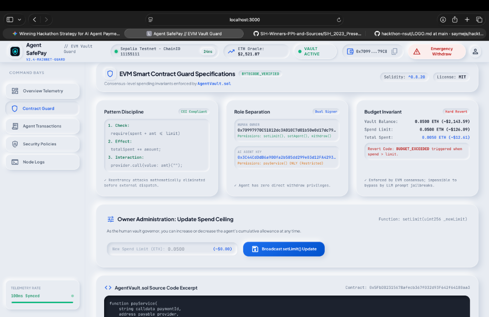
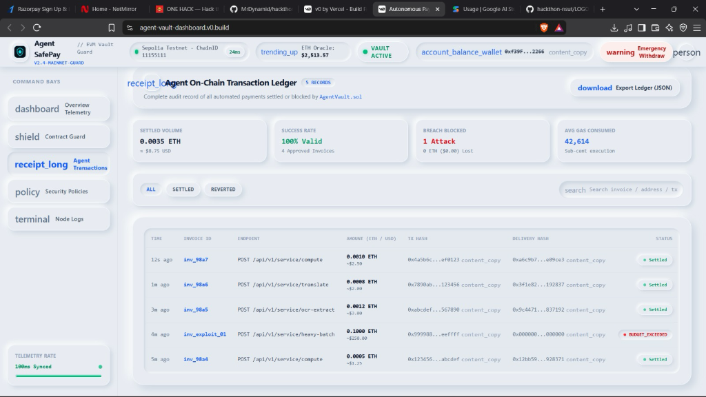

# Agent SafePay — UI Visual Architecture & Logo/Icon System 2.0

> **Permanent Visual Guard:** Explaining the difference between Image 1 (`localhost:3000`) and Image 2 (`v0.build`), why external font ligatures broke on remote deployment, and how the **System 2.0 Inline SVG Engine** guarantees icons render directly ahead of every word across the entire frontend with zero external dependencies.

---

## 1. Visual Comparison: Image 1 vs Image 2

### Image 1: Target Experience (Localhost / System 2.0)
*Clean vector icons positioned directly ahead of each Command Bay title and header label.*



---

### Image 2: The Remote Deployment Webfont Ligature Failure (`v0.build`)
*When external Google Fonts failed to download, ligature strings like `receipt_long`, `dashboard`, `shield`, `policy`, `terminal`, `download`, and `account_balance_wallet` rendered as raw text words.*



---

## 2. Why Image 2 Showed Text Instead of Icons

### The Root Cause: Webfont Ligatures
Previously, icons relied on Google's `material-symbols-outlined` webfont. This system works through **font ligatures**:
1. In the HTML, you write the word `<span className="material-symbols-outlined">receipt_long</span>`.
2. The browser makes an HTTP request to `fonts.googleapis.com` to download a `.woff2` font file.
3. The font file intercepts the word `receipt_long` and replaces the text glyphs with an icon drawing.

### Why It Broke on `agent-vault-dashboard.v0.build`:
* **Content Security Policy (CSP) & CORS:** Sandboxes like `v0.build` or isolated iframe environments often restrict cross-origin stylesheet and font downloads (`font-src 'self'`).
* **Offline / Slow Hackathon Wi-Fi:** If the connection drops or is throttled, font requests fail or timeout.
* **The Graceful Fallback Trap:** When a font fails to load, browsers fall back to default system fonts (Arial/Inter), rendering the literal ligature words (`receipt_long`, `dashboard`, `shield`, `terminal`) as unstyled text strings!

---

## 3. The Permanent Solution: System 2.0 Zero-Dependency Inline SVGs

We replaced every single font ligature across all Command Bays, navigation buttons, header chips, and transaction tables with **self-contained inline React SVG vector components** located in [`src/components/Icons.tsx`](./frontend/src/components/Icons.tsx).

### Why Inline SVGs Never Fail:
* ⚡ **Zero Network Requests:** SVGs are bundled directly into the JavaScript chunk. No external requests to Google or CDN servers.
* 🛡️ **100% Offline Resilient:** Renders identically without internet connection during hackathon presentations.
* 🎯 **Strict Hierarchy:** Icons are rendered as pure vector graphics immediately ahead of their corresponding text labels inside flex containers (`flex items-center gap-2.5`).
* 🎨 **CSS Theme Compatible:** Uses `currentColor` so active state colors (`text-blue-600`, `text-emerald-500`, `text-rose-500`) automatically apply to the vector fill/stroke.

---

## 4. Logo & Icon Registry

### Brand Logo Assets
| Asset Preview | File Path | Exact Alt Text | Purpose |
| :---: | :--- | :--- | :--- |
|  | `frontend/public/logo.png` | `Agent SafePay Vault Logo` | Primary Brand Mark (Neumorphic Glow) |
|  | `frontend/public/logo/agent-safepay-logo.png` | `Agent SafePay Vault Logo` | High-DPI Vault Shield |
|  | `frontend/public/logo.svg` | `Agent SafePay Vault Logo` | Vector Brand Asset |

---

### Command Bay Navigation Icons (Always Ahead of Words)
Located in [`src/app/page.tsx`](./frontend/src/app/page.tsx):

| Command Bay | Icon Component | Rendered Visual | Code Implementation |
| :--- | :--- | :---: | :--- |
| **Overview Telemetry** | `<DashboardIcon className="w-5 h-5 text-blue-600" />` | ⊞ | Ahead of "Overview Telemetry" |
| **Contract Guard** | `<ShieldIcon className="w-5 h-5 text-blue-600" />` | 🛡 | Ahead of "Contract Guard" |
| **Agent Transactions** | `<ReceiptIcon className="w-5 h-5 text-blue-600" />` | 🧾 | Ahead of "Agent Transactions" |
| **Security Policies** | `<PolicyIcon className="w-5 h-5 text-blue-600" />` | ⚖ | Ahead of "Security Policies" |
| **Node Logs** | `<TerminalIcon className="w-5 h-5 text-blue-600" />` | 💻 | Ahead of "Node Logs" |

---

### Header & System Telemetry Icons
| Label | Icon Component | Purpose |
| :--- | :--- | :--- |
| **ETH Oracle Price** | `<TrendingUpIcon className="w-4 h-4 text-blue-500" />` | Real-time price feed indicator |
| **Connected Wallet** | `<WalletIcon className="w-4 h-4 text-blue-500" />` | Human Owner dual-signer status |
| **Address Copier** | `<CopyIcon className="w-3.5 h-3.5 text-slate-400" />` | Quick-copy hex address |
| **Emergency Withdraw** | `<WarningIcon className="w-4 h-4 text-rose-500" />` | Fail-safe circuit breaker |
| **Governor Profile** | `<PersonIcon className="w-4 h-4 text-slate-600" />` | Governance role avatar |

---

### Action & Table Icons (No more text bugs!)
| Feature | Old Broken String | New System 2.0 SVG | File |
| :--- | :--- | :--- | :--- |
| **Export Ledger** | `download` | `<DownloadIcon className="w-4 h-4 text-blue-500" />` | `TransactionsView.tsx` |
| **Filter Search** | `search` | `<SearchIcon className="w-4 h-4 text-slate-400" />` | `TransactionsView.tsx` |
| **Copy Tx / Delivery** | `content_copy` | `<CopyIcon className="w-3 h-3 text-slate-400" />` | `TransactionsView.tsx` |
| **Audit Verification** | `verified` / `fact_check` | `<CheckCircleIcon className="w-4 h-4 text-emerald-500" />` | `PoliciesView.tsx` |
| **Replay Protection** | `replay` | `<ReplayIcon className="w-4 h-4 text-blue-500" />` | `PoliciesView.tsx` |
| **Invariant Code** | `code` | `<CodeIcon className="w-4 h-4 text-blue-500" />` | `ContractGuardView.tsx` |

---

## 5. Teammate Verification Guide (For Dhruv & Frontend Team)

1. **Verify Local Rendering:**
   ```bash
   cd frontend
   npm run dev
   ```
   Open `http://localhost:3000`. Confirm all icons in the left Command Bays and top header appear as clean, crisp SVG graphics immediately preceding each title.

2. **Verify Production Build (No external font calls):**
   ```bash
   npm run build
   ```
   The build produces completely self-contained bundles with zero external Google font calls required for icon rendering.
